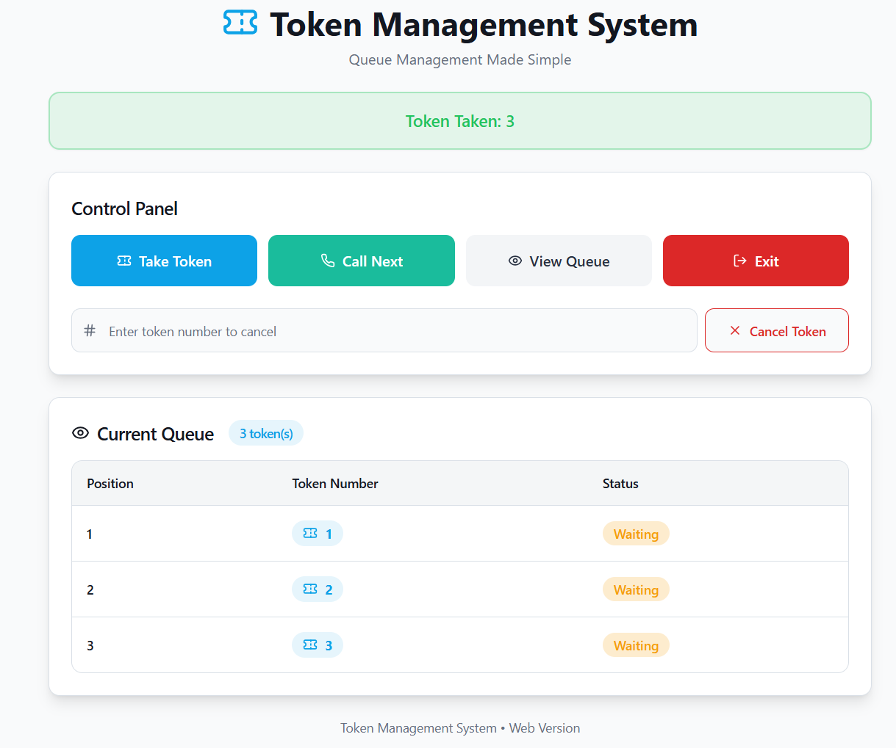
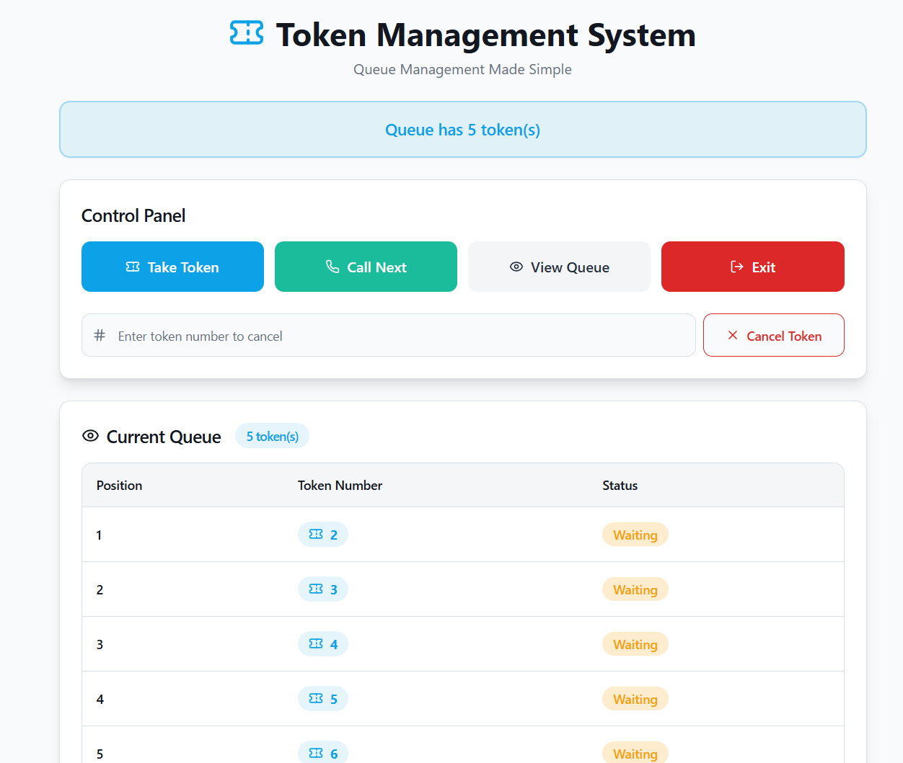
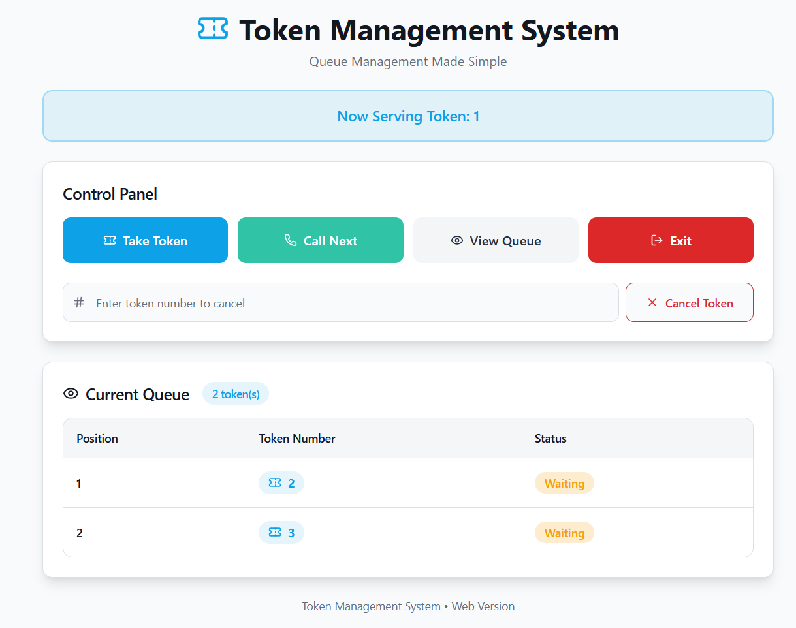

# Smart Queue Management System 

A queue Managment System built to understand how the real world queue works and how waiting time can be managed efficiently.

## Project Overview
This project was developed as a mini project to simulate a token based queue systems which is commonly seen in banks, hospitals, or service centers.

The system allows users to:
- Take a token
- View current queue
- Call the next token
- See live queue status

##  Technologies Used
- Java (Queue logic - conceptual)
- Lovable (UI generation)

## Live Demo
👉 https://smartqueuemanagment.lovable.app

## Project Structure
- `Java Logic/`-> Queue implementation logic in Java
- `README.md`-> Project documentation

## UI Screenshots
| Feature Preview |
| Token Generation |  |
| Queue Display |  |
| Now Serving |  |

## Real-World Applications
- Banks
- Hospitals
- Government offices
- Customer service centers

## Future Improvements
- Backend integration
- Database support
- Admin dashboard
- Multiple counters

👩‍💻 Developed by: Gautam A and Aditi A Kushtagi 
🎓 3rd Semester ISE Student

